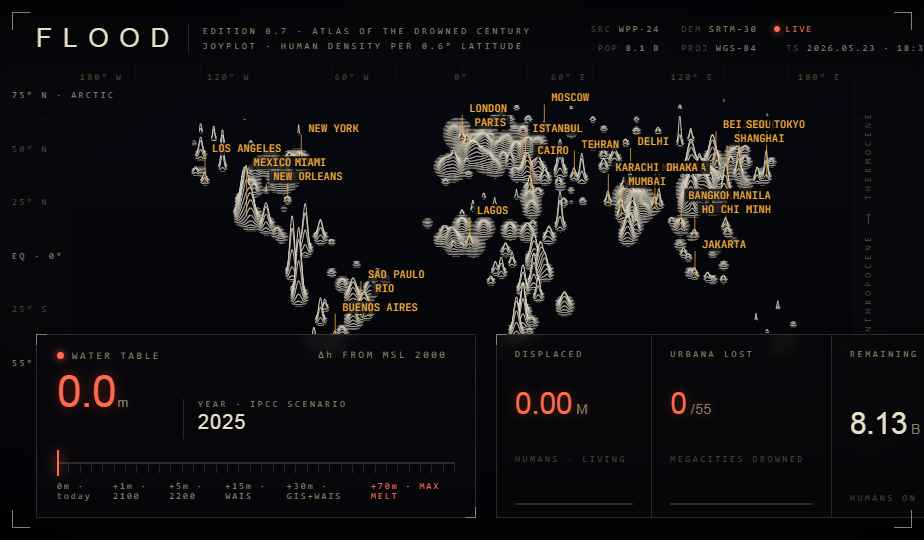

# FLOOD

**Atlas of the Drowned Century** — a dystopian-futuristic joyplot of world population, with rising-sea overlay — drag the slider and watch the world drown.

Each horizontal ridge is a 0.6° latitude band of world population density. City peaks rise sharply out of a rural baseline that traces every continent. As the **water table** slider rises (0 → 70 m of sea-level rise), coastal megacities turn red and get marked drowned, and the world's projected population shifts under per-region growth/decline curves.

## Data

The numbers are **evocative, not authoritative**. Specifically:

- **Cities** — name / lat / lon / population (millions) / centroid elevation / coastal flag. Hand-curated to UN World Urbanization Prospects 2024 magnitudes.
- **Rural anchors + land seeds** — procedurally placed to give every populated landmass a baseline density. Not derived from a real raster.
- **Elevation** — single-cell city-center values plus a handful of coastal lowland seeds (Bangladesh delta, Mekong, Java, Mississippi, etc.). Real flood modelling would use SRTM / Terrarium tiles.
- **Population growth/decline** — per-region multipliers calibrated to UN WPP-2024 through 2100, then **speculative** climate-impacted projections beyond. Each of 12 regions has its own curve (Sub-Saharan Africa peaks ~2.5× around 2200; East Asia drops below 0.4× by 2200; everything tails off post-2400).
- **Sea-level → year mapping** — calibrated to mainstream climate science: ~1 m by 2100 (IPCC AR6 SSP5-8.5), multi-millennial commitment to ~10 m, full-melt theoretical max (~70 m) only at the 10,000+ year scale.

**GPW** (Gridded Population of the World, NASA SEDAC) — global population raster at up to 30 arc-second resolution, **requires a free NASA Earthdata / SEDAC account** at [sedac.ciesin.columbia.edu](https://sedac.ciesin.columbia.edu/data/collection/gpw-v4); 

**SRTM** (Shuttle Radar Topography Mission) — global elevation at 30 m / 90 m, **scriptable** via [OpenTopography](https://opentopography.org/) or the USGS EarthExplorer API; and **WPP raw** (UN World Population Prospects 2024) — country-level CSVs from [population.un.org/wpp](https://population.un.org/wpp/Download/).